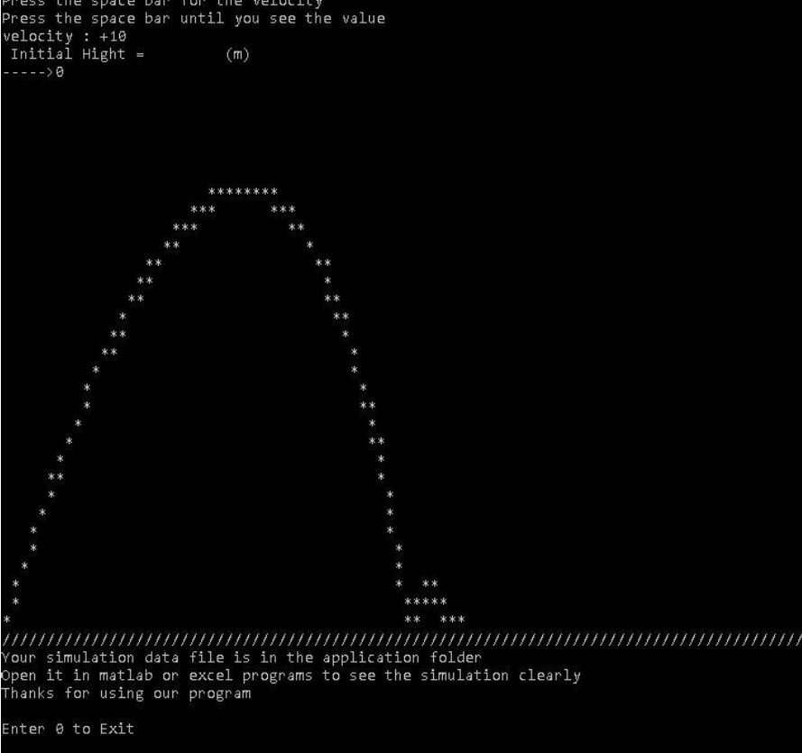
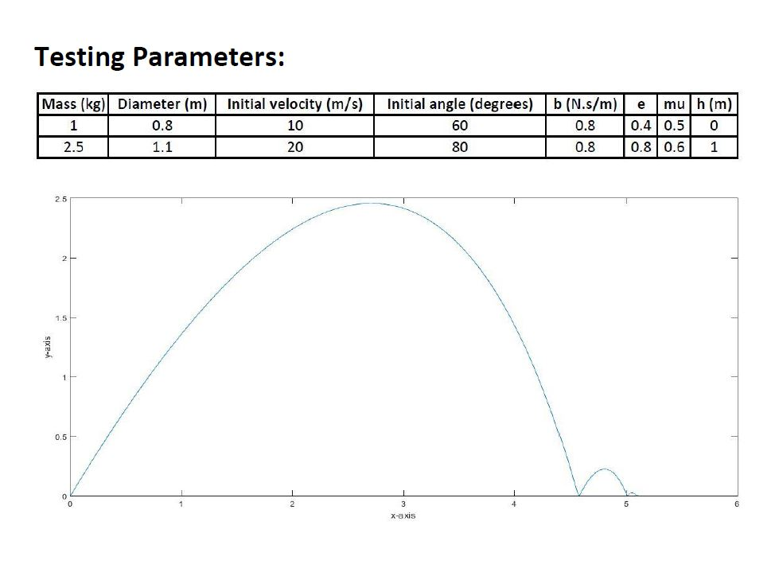

# projectile_simulator
This application is a simulation of a projectile on the windows terminal only not GUI.

Using the eqations in the projectile simulation PDF
I wrote the code in C++

and the results are in the projictile simulation report PDF

And here is the testing of the same inputs on matlab

